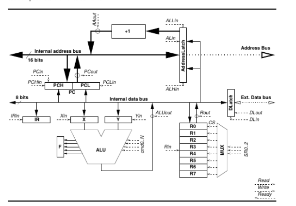

# Simulateur d'une micro-architecture

----

**Auteur :** Hugo Rassé  
**Contexte :** TP 1 Archi+  
**Année :** 3e année Licence Informatique  

### Présentation du TP

Le but de ce TP était de réaliser un simulateur, en langage C, de l'architecture d'un microprocesseur mono-bus donné. 
Le programme devait être capable de reproduire toutes les étapes d'exécution d'une instruction sur la micro-architecture du processeur donné.

<div align="center"></div>

### Arborescence du projet

📦Simulateur  
 ┣ 📂Hex  
 ┃ ┣ 📜p1.hex  
 ┃ ┣ 📜p2.hex  
 ┃ ┗ 📜prog.hex  
 ┣ 📂src  
 ┃ ┣ 📜debug.c  
 ┃ ┣ 📜debug.h  
 ┃ ┣ 📜main.c  
 ┃ ┣ 📜MPU.c  
 ┃ ┗ 📜MPU.h  
 ┣ 📜Makefile  
 ┣ 📜README.md  


### Commandes disponibles

```
$ ./Simulateur /Hex/p1.hex
> h
Liste des commandes : 

b -- Arrête le programme à la ligne donnée
h -- Affiche ce message
r -- Lance le programme
q -- Quitter
```